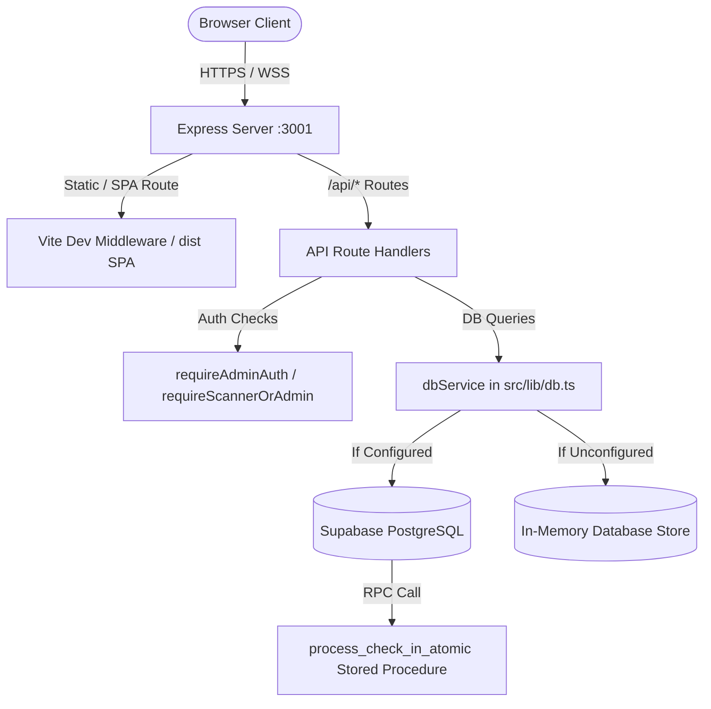
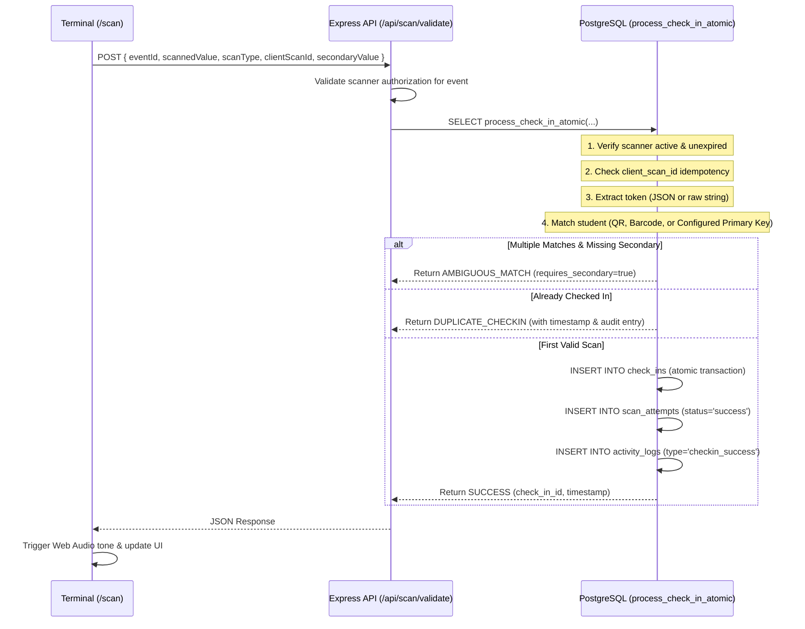
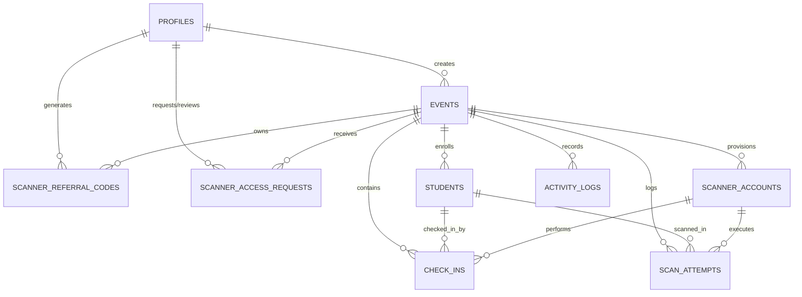

# ADMITTO — Technical Brain & System Architecture Specification

> **Document Version:** 1.0.0  
> **Target System:** ADMITTO — Digital Event Access & Token Scanning Platform  
> **Source of Truth:** Repository codebase at `admitto---digital-event-access-&-token-scanning-platform`  
> **Intended Audience:** AI Developers, Lead Architects, and Engineers maintaining or extending the codebase.

---

## 1. PROJECT OVERVIEW

### 1.1 Project Name
**ADMITTO** (`react-example` in `package.json`, branded as **ADMITTO — Digital Event Access & Token Validation Platform** in `metadata.json` and `index.html`).

### 1.2 Project Purpose
ADMITTO is a high-throughput, multi-tenant digital event access and token validation platform. It is engineered to eliminate entrance congestion, badge sharing, duplicate check-ins, and race conditions during high-volume event check-ins (e.g., college summits, hackathons, conferences, and auditoriums).

### 1.3 Main Problem Being Solved
Traditional event check-in systems rely on paper rosters, spreadsheet lookups, or naive client-side validation logic. In high-concurrency environments with multiple gate volunteers scanning attendees simultaneously, read-then-write logic allows duplicate admissions. Additionally, poor network connectivity (e.g., basement auditoriums) often freezes operations. ADMITTO solves this via:
1. Database-enforced atomic uniqueness transactions (`UNIQUE(event_id, student_id)` and `UNIQUE(event_id, client_scan_id)`).
2. Offline-first scanning with client-side queuing, cryptographic idempotency keys, and seamless batch re-synchronization.
3. Strict multi-tenant isolation via PostgreSQL Row Level Security (RLS) and server-authoritative JWT verification.
4. Flexible identifier mapping supporting dynamic primary keys (USN, Email, Name, or custom CSV headers) and secondary verification keys to resolve duplicates.

### 1.4 Target Users
- **Event Organizers / Admins:** Coordinators who create events, import attendee rosters (CSV/XLSX), configure scanning parameters, provision gate terminals, monitor live attendance analytics, and export audit trails.
- **Gate Volunteers / Scanners:** Station operators who use mobile phones, tablets, or barcode guns to scan attendees' 2D QR codes or 1D barcodes with sub-50ms feedback and audio/haptic cues.
- **Attendees / Students (End Recipients):** Receive unique digital event access passes with 2D QR codes and 1D barcodes.

### 1.5 Current Project Status
**Production-Ready / Active Development.**
- Complete dual-engine database layer: Full Supabase PostgreSQL schema with migrations (RLS, indexes, atomic RPC stored procedures) alongside an in-memory fallback engine for offline or standalone operation.
- Express 4.x backend server running unified API routes and embedding Vite development middleware.
- Full React 19 SPA frontend with dark luxury aesthetic, hardware-accelerated animations, live dashboard metrics, and camera scanning integration (`html5-qrcode`).

### 1.6 Major Features Currently Implemented
- **Multi-Tenant Event Management:** Event creation, update, gradient branding, schedule/venue settings, and soft/hard delete.
- **Attendee Registry & Bulk Import:** Drag-and-drop CSV and Excel (.xlsx) parser (`papaparse` + `xlsx`) with column mapping, uniqueness pre-validation, and dynamic metadata persistence.
- **Configurable Scan Keys & QR Modes:** Primary scanning key selection, secondary fallback keys for disambiguation, and selectable QR modes (`SECURE_TOKEN` vs. `FULL_DATA`).
- **Real-Time Camera & Barcode Scanner:** Camera feed via `html5-qrcode`, environmental/user camera flipping, torch/flash toggle, audio feedback synthesis (`Web Audio API`), and laser gun physical barcode support.
- **Offline Scanning Engine:** Local FIFO scan queue (`localStorage`) with cryptographic `client_scan_id` tags and automatic/manual batch sync.
- **Gate Access Delegation:** Dual-mode scanner access: direct static gate accounts (`GATE-XXX`) and dynamic admin-approved scanner access requests via short-lived referral codes.
- **Telemetry & Live Analytics:** Real-time metrics (check-in percentage, branch/year breakdowns, scan method counts), live audit logs, and one-click CSV report exports.

---

## 2. TECHNOLOGY STACK

### 2.1 Core Technologies
- **Runtime:** Node.js (with TypeScript execution via `tsx` in development).
- **Frontend Framework:** React 19.0.1 (`react`, `react-dom`).
- **Backend Framework:** Express 4.21.2 (`express`).
- **Language:** TypeScript ~5.8.2 (`tsconfig.json` targeting ES2022).
- **Build Tool / Bundler:** Vite 6.2.3 (`@vitejs/plugin-react`) + `esbuild` 0.25.0 for production server bundling.
- **Testing Framework:** Vitest 3.2.4 (`vitest` with `@/` path alias in `vitest.config.ts`).
- **Package Manager:** npm (with lockfile `package-lock.json` present; `bun.lock` also present in root).

### 2.2 Styling & UI Framework
- **CSS Framework:** Tailwind CSS v4.1.14 (`@tailwindcss/vite`, `tailwindcss`).
- **Design System:** Custom dark theme palette (`#030408` base, mesh gradients, glassmorphism, Apple-style physics).
- **Typography:** Google Fonts (`Plus Jakarta Sans` for body, `Space Grotesk` for display headings and numbers).
- **Icons:** `lucide-react` (v0.546.0).
- **Animations:** `motion` (v12.23.24, Motion for React).
- **Visual Effects:** `canvas-confetti` (v1.9.4).

### 2.3 Database & Cloud Backend
- **Database:** Supabase PostgreSQL 15 (with extensions `uuid-ossp`).
- **Client Libraries:** `@supabase/supabase-js` (v2.112.4).
- **Database Architectural Pattern:** Dual-mode (Supabase Cloud PostgreSQL with stored RPC procedures when configured; in-memory schema fallback when unconfigured).
- **Security:** PostgreSQL Row Level Security (RLS) policies, immutable audit logs (`REVOKE DELETE ON activity_logs`), and payload size constraints.

### 2.4 Authentication & Session Security
- **Admin Auth:** Supabase Auth (Email + Password, Google OAuth via `signInWithOAuth`, password recovery, and email verification) linked to `public.profiles` via database trigger; fallback mode uses `bcryptjs` password hashing (10 salt rounds).
- **Scanner Auth:** Custom CSPRNG 256-bit token sessions (`scan_tok_${crypto.randomBytes(32).toString('hex')}`) linked to `scanner_accounts` or approved `scanner_access_requests`.
- **Session Handling:** HTTP Bearer token headers and in-memory server session caching with fallback JWT validation. Active revocation hook terminates sessions immediately upon scanner deactivation.
- **Rate Limiting:** `express-rate-limit` protecting `/api/auth/*` (10 req/15 min), `/api/scanner/request-access` (10 req/15 min), and `/api/scan/*` (120 req/min).

### 2.5 Hardware & Multimedia APIs
- **Camera Scanning:** `html5-qrcode` (v2.3.8).
- **QR Code Generation:** `qrcode` (v1.5.4).
- **Spreadsheet Parsing:** `xlsx` (v0.18.5) and `papaparse` (v5.7.0).
- **Audio Synthesis:** Native browser `AudioContext` (Web Audio API) in `src/lib/sound.ts` (generates chimes, error buzzers, and reminder pulses without external mp3 files).
- **Haptic Feedback:** `navigator.vibrate` API.
- **Device Sensors:** `DeviceOrientationEvent` (gyroscope/accelerometer) in `Watermark3DGyroBanner.tsx`.

### 2.6 External Services & Libraries
- `bcryptjs` (v3.0.3) & `@types/bcryptjs`: Cryptographic password hashing and verification.
- `express-rate-limit` (v7.5.0): IP-based endpoint throttling.
- `dotenv` (v17.2.3): Environment configuration loader.
- *(Note: `@google/genai` was removed as an uninvoked dependency to maintain a zero-bloat production bundle).*

---

## 3. PROJECT STRUCTURE

```
admitto---digital-event-access-&-token-scanning-platform/
├── .env                              # Local environment variables (git-ignored)
├── .env.example                      # Template defining required environment keys
├── .gitignore                        # Git ignore patterns
├── README.md                         # Project overview and run instructions
├── bun.lock                          # Bun lockfile
├── cloudflared.exe                   # Cloudflare tunnel utility (for HTTPS mobile testing)
├── dist/                             # Production build output directory
│   ├── index.html                    # Built frontend SPA entry
│   ├── assets/                       # Compiled CSS and JS bundles
│   └── server.cjs                    # Bundled Express production server
├── generate_test_datasets.mjs        # Script to generate sample XLSX files
├── index.html                        # Vite HTML entry point with web fonts & meta
├── metadata.json                     # AI Studio metadata & permission configuration
├── package.json                      # Dependencies and npm scripts
├── package-lock.json                 # Locked npm dependency tree
├── public/                           # Static assets
│   ├── favicon.png                   # App icon
│   ├── logo.png                      # ADMITTO high-res logo
│   └── assets/aistudio/.gitignore    # Asset directory marker
├── server.ts                         # Main Express server and API route definitions
├── test_dataset_duplicates.xlsx      # Test dataset with duplicate rows
├── test_dataset_unique.xlsx          # Test dataset with unique identifiers
├── tests/                            # Automated test suites (Vitest)
│   ├── unit/
│   │   ├── tokens-and-matching.test.ts  # Token formats, CSPRNG, ambiguity matching
│   │   ├── offline-queue.test.ts        # FIFO ordering, idempotency tags, sync mechanics
│   │   └── dual-engine-drift.test.ts    # In-memory vs Supabase schema & contract parity
│   ├── integration/
│   │   └── concurrency.test.ts          # 100 concurrent scans -> 1 success, 99 duplicates
│   └── security/
│       └── security-and-rbac.test.ts    # RBAC, audit immutability, rate limiting, expiry
├── tsconfig.json                     # TypeScript compiler configuration
├── vite.config.ts                    # Vite build and dev server configuration
├── vitest.config.ts                  # Vitest test configuration
├── supabase/                         # Database schema & migrations
│   └── migrations/
│       ├── 001_initial_schema.sql    # Base tables: profiles, events, students, etc.
│       ├── 002_rls.sql               # Row Level Security policies
│       ├── 003_indexes.sql           # Composite and lookup B-tree indexes
│       ├── 004_functions.sql         # process_check_in_atomic stored procedure
│       ├── 005_scanner_referral_and_requests.sql # Referral codes & access requests
│       ├── 006_configurable_scan_keys_and_qr_modes.sql # Flex keys, JSONB meta, dynamic RPC
│       ├── 007_supabase_auth_integration.sql # auth.users sync trigger & RLS
│       └── 008_audit_integrity_and_security_hardening.sql # Immutable logs, referral limits, 32KB meta check
└── src/
    ├── main.tsx                      # React root rendering with StrictMode & ErrorBoundary
    ├── App.tsx                       # Client-side router, global session, and route coordinator
    ├── index.css                     # Design tokens, Tailwind imports, keyframes, scrollbars
    ├── types.ts                      # Shared TypeScript domain models and interfaces
    ├── vite-env.d.ts                 # Vite environment type declarations
    ├── hooks/
    │   └── useNetworkMonitor.ts      # Online/offline status, ping health checks, retry timer
    ├── lib/
    │   ├── api.ts                    # Client HTTP API client, token injection, offline queue
    │   ├── db.ts                     # Unified database service (Supabase RPC + In-memory fallback)
    │   ├── sound.ts                  # Web Audio API procedural sound synthesizer & haptics
    │   ├── supabaseAuth.ts           # Supabase Auth client operations (email, OAuth, reset)
    │   └── supabase/
    │       ├── client.ts             # Browser-safe Supabase client (Anon key)
    │       ├── index.ts              # Supabase module re-exports
    │       └── server.ts             # Server-side Supabase client (Service Role key)
    ├── components/
    │   ├── admin/
    │   │   ├── AdminLayout.tsx       # Admin header, sidebar/tab bar, event switcher, and tabs
    │   │   └── MetricDetailModal.tsx # Drilldown inspect modal for stats, lists, and direct toggle
    │   ├── auth/
    │   │   └── AuthRequiredModal.tsx # Guest intercept modal prompting login/signup
    │   ├── common/
    │   │   ├── AppLogo.tsx           # Scalable SVG logo mark with gradient fills
    │   │   ├── AppleScrollProgress.tsx # Top 2px dynamic scroll progress indicator
    │   │   ├── AppleScrollReveal.tsx # Framer motion viewport scroll reveals and stagger containers
    │   │   ├── DigitalEventPassModal.tsx # Printable/downloadable attendee digital pass with QR
    │   │   ├── ErrorBoundary.tsx     # React component crash recovery wrapper
    │   │   ├── GoogleIcon.tsx        # Official multi-color Google SVG icon
    │   │   ├── LiquidBackground.tsx  # Animated liquid canvas background with radial gradients
    │   │   ├── NetworkErrorView.tsx  # Fullscreen reconnecting/offline diagnostic view
    │   │   ├── ScrollingCautionTape.tsx # Animated marquee caution tape banner
    │   │   ├── Skeleton.tsx          # Shimmer skeleton loading components for all views
    │   │   └── Watermark3DGyroBanner.tsx # Interactive 3D gyroscope/mouse parallax badge
    │   ├── public/
    │   │   ├── Footer.tsx            # Full marketing footer with dynamic watermarks and links
    │   │   ├── Navbar.tsx            # Sticky frosted navbar with route links and CTA
    │   │   └── StartNowModal.tsx     # Role selector modal (Admin Console vs Gate Scanner)
    │   └── scanner/
    │       ├── AdmittoScannerTerminal.tsx # Camera viewport, scanner overlay, manual code entry
    │       ├── AppleDock.tsx         # Floating iOS-style bottom dock with badges
    │       ├── ScannerAccessGatekeeper.tsx # Gatekeeper screen for volunteers requesting access
    │       ├── ScannerHomeTab.tsx    # Event details, admin contact, WhatsApp link, summary cards
    │       ├── ScannerLogTab.tsx     # Filterable log of recent check-in attempts on this device
    │       ├── ScannerRosterTab.tsx  # Searchable attendee roster with manual check-in override
    │       ├── ScannerSettingsTab.tsx # Audio, haptic, torch, cooldown, and camera preferences
    │       └── ScannerStatsTab.tsx   # Visual admission progress, branch breakdowns, pie metrics
    └── pages/
        ├── admin/
        │   ├── ActivityLogsPage.tsx  # Chronological audit trail of all system actions
        │   ├── AdminSettingsPage.tsx # DB health, session info, and permanent purge action
        │   ├── DashboardPage.tsx     # High-level event KPIs, quick actions, and recent activity
        │   ├── EventSettingsPage.tsx # Title, venue, date, gradient banner, and scan key configs
        │   ├── ScannersManagementPage.tsx # Provision gate stations, referral codes, approve requests
        │   ├── ScansHistoryPage.tsx  # Detailed tabular log of all QR/barcode check-in attempts
        │   └── StudentsPage.tsx      # Attendee database, bulk import modal, pass issuance
        ├── auth/
        │   ├── AuthCallbackPage.tsx  # OAuth redirect handler and exchange validator
        │   ├── ForgotPasswordPage.tsx# Email password reset request form
        │   ├── LoginPage.tsx         # Dual-mode login (Supabase email/Google vs Gate access code)
        │   ├── ResetPasswordPage.tsx # New password entry screen after email recovery link
        │   ├── SignupPage.tsx        # New admin organizer account registration
        │   └── VerifyEmailPage.tsx   # Email confirmation notice with resend countdown
        ├── public/
        │   ├── AboutPage.tsx         # Mission, problem statement, and developer architecture
        │   ├── BlogPage.tsx          # Technical engineering write-ups & detail modal
        │   ├── FaqPage.tsx           # Accordion FAQ on RLS, offline sync, and concurrency
        │   ├── FeaturesPage.tsx      # Feature breakdown grid
        │   ├── HomePage.tsx          # Landing hero, features preview, and gyro demo badge
        │   ├── HowItWorksPage.tsx    # 6-step walkthrough of the platform workflow
        │   ├── ReviewsPage.tsx       # Institutional case studies and testimonials
        │   └── SecurityPage.tsx      # Technical deep-dive on RLS, encryption, and zero-trust
        └── scanner/
            └── ScannerPage.tsx       # Root coordinator for gate terminal (dock, tabs, camera lifecycle)
```

---

## 4. APPLICATION ARCHITECTURE

### 4.1 System Overview
ADMITTO operates as a hybrid full-stack application. An Express server (`server.ts`) handles API requests and serves the compiled React application. In development mode, Vite middleware runs directly inside Express for fast HMR.



### 4.2 Frontend Architecture
- **Routing:** Path-based SPA routing orchestrated in `App.tsx` using `window.history.pushState` and `popstate` listeners. No external routing package like `react-router-dom` is used; routes are handled via deterministic path matching.
- **Swipe Gestures:** Horizontal touch swipe listener enables gesture navigation across public pages and scanner tabs.
- **Skeleton Architecture:** Global `0.4s` - `0.5s` transition delay displaying custom animated skeleton screens (`Skeleton.tsx`) to prevent visual layout shifts.
- **Client API Layer:** `src/lib/api.ts` abstracts all `fetch` calls, automatically attaching the Supabase JWT (for Admins) or custom Bearer token (for Scanners).

### 4.3 Backend Architecture
- **Middleware & Rate Limiting:** JSON body parsing with a 10MB limit (for bulk attendee imports), Bearer session extraction, route protection middlewares (`requireAdminAuth`, `requireScannerOrAdmin`), and tiered IP rate limiters via `express-rate-limit`:
  - `authLimiter`: 10 attempts / 15 min on `/api/auth/login` and `/api/auth/register`.
  - `requestAccessLimiter`: 10 requests / 15 min on `/api/scanner/request-access`.
  - `scanLimiter`: 120 validations / min on `/api/scan/validate` and `/api/scan/batch-sync`.
- **Session Security & Invalidation:** Fast in-memory map (`activeSessions`) storing verified Supabase JWTs and CSPRNG 256-bit scanner tokens (`scan_tok_*`). Scanner sessions undergo real-time database validation on every request via `getSessionFromReq`; deactivating or deleting a scanner triggers `notifyScannerInvalidated(scannerId)` which immediately purges active tokens.
- **Single-Use Export Authentication:** Attendee CSV report downloads require a cryptographically random, 60-second single-use export token generated via `POST /api/events/:id/export-token`.
- **Batch Safeguards:** Attendee imports are capped at 5,000 records per request (`/students/import`), and offline sync is capped at 500 scans per request (`/batch-sync`).
- **Production Startup Safeguard:** When `NODE_ENV === 'production'`, the server verifies valid, non-placeholder Supabase credentials before listening, exiting with code 1 if unconfigured.
- **Dual Data Persistence Engine:** `dbService` dynamically routes operations to Supabase PostgreSQL when credentials exist, or executes identical transactional logic on an in-memory structure (`inMemoryDB`) when Supabase is offline.

### 4.4 Centralized Atomic Check-In Engine
Check-in operations pass through `process_check_in_atomic` (implemented both as a PL/pgSQL database function in `006_configurable_scan_keys_and_qr_modes.sql` and in TypeScript inside `db.ts`):



---

## 5. USER FLOWS

### 5.1 First-Time Visitor & Public Exploration Flow
1. Visitor arrives at `/`.
2. Can explore public marketing pages: `/how-it-works`, `/features`, `/security`, `/reviews`, `/blog`, `/faq`, `/about`.
3. Clicking **"Get Started"** or **"Start Now"** opens `StartNowModal.tsx`, presenting two choices:
   - **Admin Console:** Directs to `/login` (with `returnTo=/admin`).
   - **Gate Scanner:** Directs to `/scan` (which renders `ScannerAccessGatekeeper.tsx`).

### 5.2 Admin Registration & Login Flow
1. **Sign Up (`/signup`):** Enters Name, Email, Password. Invokes `signUpWithEmail()` via Supabase Auth.
   - If Supabase email confirmation is enabled: redirects to `/verify-email`.
   - If confirmation is disabled: automatically creates session and redirects to `/admin`.
   - Supabase trigger `handle_new_auth_user()` automatically provisions a row in `profiles` with role `ADMIN`.
2. **Login (`/login`):**
   - **Email/Password:** Authenticates against Supabase Auth; stores session in `localStorage`.
   - **Google OAuth:** Invokes `signInWithGoogle()`, redirects to Google consent, returns to `/auth/callback`.
3. **Admin Onboarding:** If the admin has 0 events, a welcoming empty-state card prompts **"Create Your First Event"**.

### 5.3 Event Management & Attendee Import Flow
1. Admin creates event (Title, Venue, Date, Organizer contact, Banner gradient).
2. Admin opens **Attendees & Tokens** tab (`StudentsPage.tsx`).
3. Admin clicks **"Import CSV / Excel"** and drops a file (`.csv`, `.xlsx`, `.xls`).
4. **Column Mapping & Uniqueness Verification:**
   - System maps fields: USN/ID, Name, Email, Phone, Year, Section, Branch.
   - Admin configures the **Primary Scanning Key** (e.g., USN, Badge Number).
   - System pre-validates dataset for duplicates. If duplicate values are found on the primary key, it mandates selecting a **Secondary Key** (e.g., Email or Phone) for disambiguation.
5. Imports records into `students` table. Each attendee is assigned:
   - Dynamic QR payload (secure token or JSON).
   - 1D linear barcode string.
6. Admin can inspect individual attendee passes via `DigitalEventPassModal.tsx` and copy or print passes.

### 5.4 Gate Scanner Access Flows
ADMITTO supports two distinct scanner authentication workflows:

#### Flow A: Dynamic Referral & Approval Flow (Recommended)
1. Admin goes to **Gate Scanners** tab (`ScannersManagementPage.tsx`) -> **Referral Codes** -> generates an active code (e.g., `SCAN-7X9K2M`).
2. Volunteer logs into ADMITTO with their personal email and opens `/scan`.
3. `ScannerAccessGatekeeper.tsx` prompts for the Referral Code.
4. Volunteer submits code; request status transitions to `PENDING`.
5. Admin views pending requests in **Scanners Management**, assigns a gate (e.g., "Main Gate North") and validity duration (e.g., 8 hours), and clicks **Approve**.
6. Volunteer's gatekeeper automatically refreshes to `APPROVED` and unlocks `AdmittoScannerTerminal.tsx`.

#### Flow B: Static Gate Station Direct Login
1. Admin provisions a named Gate Station (e.g., `GATE-NORTH-1`) with an access password.
2. Volunteer navigates to `/login`, toggles to **"Scanner Access Code"** mode, and enters station credentials.
3. Server issues a `scan_tok_*` session and immediately launches `/scan`.

### 5.5 Check-In Execution & Offline Sync Flow
1. Scanner points device camera at attendee badge.
2. `html5-qrcode` decodes token and sends `POST /api/scan/validate`.
3. **If Online:** Receives instant response:
   - **SUCCESS:** Green flash, affirmative double chime, attendee details displayed.
   - **DUPLICATE:** Yellow/red warning banner, descending double buzz, shows previous check-in timestamp.
   - **AMBIGUOUS_MATCH:** Scanner prompts for secondary key input (e.g., email verification).
4. **If Offline (Dead Zone):**
   - Network monitor detects loss of connection or API unreachable.
   - Scan is immediately tagged with a cryptographically secure UUID `client_scan_id` and queued locally in `localStorage` under `admitto_offline_scans_queue`.
   - UI presents an explicit **`QUEUED_OFFLINE`** status card ("Queued for Sync • Stored Locally") rendered in calming amber/cyan with `role="status"` and `aria-live="polite"`. It avoids deceptive "APPROVED" messaging while confirming local persistence.
   - Top banner updates showing the pending offline scan count.
   - Upon network reconnection, volunteer clicks **"Sync Scans"** (or auto-sync triggers), sending `POST /api/scan/batch-sync`.
   - Server processes each scan idempotently via `process_check_in_atomic`. Re-transmitted scans return `IDEMPOTENT_SUCCESS` without corrupting counts.
   - Scans that were previously admitted by another gate while offline are marked as **`POST-SYNC DUPLICATE`** in the local device log, clearly displaying the timestamp of the earlier admission.

---

## 6. AUTHENTICATION & AUTHORIZATION

### 6.1 Authentication Architecture
- **Primary Auth Provider:** Supabase Auth (GoTrue).
- **Scanner & Local Auth:** Gate stations and fallback admin credentials use `bcryptjs` password hashing (10 salt rounds) with cryptographic verification.
- **Token Generation:** All scanner sessions use 256-bit cryptographically secure pseudorandom tokens (`scan_tok_${crypto.randomBytes(32).toString('hex')}`).
- **Client Session Storage:** `localStorage.getItem('admitto_auth_session')` storing:
  ```ts
  {
    token: string, // Supabase access_token JWT or scan_tok_* string
    user: {
      id: string,
      email: string,
      name: string,
      role: 'ADMIN' | 'SCANNER',
      event_id?: string,
      event_title?: string
    }
  }
  ```

### 6.2 Role Checking & Protected Routes
- **`ADMIN` Role:** Access to `/admin` and all management APIs (`/api/events/*`, `/api/events/:id/students/*`, `/api/events/:id/scanners/*`, etc.). Enforced via `requireAdminAuth` middleware.
- **`SCANNER` Role:** Access to `/scan` and scanning validation endpoints (`/api/scan/validate`, `/api/scan/batch-sync`, `/api/events/:id/students`). Enforced via `requireScannerOrAdmin` middleware.

### 6.3 Security-Related Implementation & Boundaries
- **JWT Verification:** `server.ts` validates incoming Supabase JWTs via `supabaseAdmin.auth.getUser(token)` and checks corresponding entries in `profiles`.
- **Active Scanner Revocation:** Scanner sessions are not merely trusted from memory tokens; `getSessionFromReq` performs real-time account status checks against `db.getScannerById()`. Deactivating or deleting a scanner triggers `notifyScannerInvalidated(scannerId)`, immediately ejecting active devices.
- **Rate Throttling:** Brute-force protection on authentication and scanner access request endpoints via `express-rate-limit`.
- **Secret Isolation:** The `SUPABASE_SERVICE_ROLE_KEY` is strictly confined to server-side execution (`server.ts` and `src/lib/supabase/server.ts`). It is never bundled into client Vite code.
- **Event Scoping:** When a scanner makes a check-in request, `validateScannerEventAccess()` verifies that the scanner account belongs to the targeted `event_id` and has not expired or been disabled by an admin.

---

## 7. DATABASE ARCHITECTURE

### 7.1 Database Technology
- **Engine:** PostgreSQL 15 (managed via Supabase).
- **Schema Management:** Sequential SQL migration files located in `supabase/migrations/`.

### 7.2 Tables & Relationships



### 7.3 Detailed Table Schema

#### 1. `profiles`
- `id` (UUID, PK, default `uuid_generate_v4()`)
- `auth_id` (UUID, UNIQUE, nullable): Foreign reference to `auth.users.id`.
- `email` (TEXT, UNIQUE, NOT NULL)
- `name` (TEXT, NOT NULL)
- `role` (TEXT, NOT NULL, DEFAULT `'ADMIN'`, CHECK in `('ADMIN', 'SCANNER')`)
- `password_hash` (TEXT, nullable)
- `created_at`, `updated_at` (TIMESTAMPTZ)

#### 2. `events`
- `id` (UUID, PK)
- `admin_id` (UUID, FK -> `profiles.id` ON DELETE CASCADE)
- `title` (TEXT, NOT NULL)
- `description` (TEXT)
- `venue` (TEXT, DEFAULT `'Main Auditorium'`)
- `event_date` (TIMESTAMPTZ)
- `admin_name`, `admin_phone`, `admin_email` (TEXT)
- `banner_url` (TEXT)
- `status` (TEXT, CHECK in `('ACTIVE', 'ARCHIVED', 'DELETED')`)
- `primary_scan_field` (TEXT, DEFAULT `'usn'`)
- `secondary_scan_field` (TEXT, nullable)
- `qr_mode` (TEXT, CHECK in `('SECURE_TOKEN', 'FULL_DATA')`)
- `barcode_field` (TEXT, DEFAULT `'usn'`)
- `scan_config` (JSONB)
- `created_at`, `updated_at`, `deleted_at` (TIMESTAMPTZ)

#### 3. `students`
- `id` (UUID, PK)
- `event_id` (UUID, FK -> `events.id` ON DELETE CASCADE)
- `sl_no` (INT)
- `usn` (TEXT, NOT NULL)
- `name` (TEXT, NOT NULL)
- `email`, `phone_number`, `year`, `section`, `branch` (TEXT)
- `qr_code` (TEXT, NOT NULL)
- `barcode` (TEXT, NOT NULL)
- `meta` (JSONB, DEFAULT `'{}'::jsonb`): Stores arbitrary unmapped CSV columns.
- `created_at`, `updated_at` (TIMESTAMPTZ)
- **Constraints:** `UNIQUE(event_id, qr_code)`, `UNIQUE(event_id, barcode)`, `CHECK (octet_length(meta::text) <= 32768)`. Capped at 5,000 attendees per batch import.

#### 4. `scanner_accounts`
- `id` (UUID, PK)
- `event_id` (UUID, FK -> `events.id` ON DELETE CASCADE)
- `email` (TEXT, NOT NULL)
- `password_hash` (TEXT, NOT NULL)
- `access_code` (TEXT, NOT NULL)
- `name` (TEXT, NOT NULL)
- `role` (TEXT, DEFAULT `'SCANNER'`)
- `is_active` (BOOLEAN, DEFAULT TRUE)
- `expires_at`, `last_login_at` (TIMESTAMPTZ)
- **Constraints:** `UNIQUE(event_id, email)`, `UNIQUE(event_id, access_code)`.

#### 5. `check_ins`
- `id` (UUID, PK)
- `event_id` (UUID, FK -> `events.id` ON DELETE CASCADE)
- `student_id` (UUID, FK -> `students.id` ON DELETE CASCADE)
- `scanner_id` (UUID, FK -> `scanner_accounts.id` ON DELETE SET NULL)
- `scan_type` (TEXT, CHECK in `('QR', 'BARCODE')`)
- `check_in_at` (TIMESTAMPTZ, DEFAULT NOW())
- `status` (TEXT, DEFAULT `'SUCCESS'`)
- `source` (TEXT, CHECK in `('online', 'offline_sync')`)
- `client_scan_id` (TEXT, nullable): Idempotency token from offline scanners.
- **Constraints:** `UNIQUE(event_id, student_id)`, `UNIQUE(event_id, client_scan_id)`.

#### 6. `scan_attempts`
- `id` (UUID, PK)
- `event_id` (UUID, FK -> `events.id` ON DELETE CASCADE)
- `student_id` (UUID, FK -> `students.id` ON DELETE SET NULL)
- `scanned_value` (TEXT, NOT NULL)
- `scan_type` (TEXT, CHECK in `('QR', 'BARCODE')`)
- `result` (TEXT, CHECK in `('success', 'duplicate', 'invalid', 'wrong_method', 'wrong_event', 'scanner_disabled')`)
- `reason` (TEXT)
- `scanner_id` (UUID, FK -> `scanner_accounts.id` ON DELETE SET NULL)
- `timestamp` (TIMESTAMPTZ, DEFAULT NOW())

#### 7. `activity_logs`
- `id` (UUID, PK)
- `event_id` (UUID, FK -> `events.id` ON DELETE CASCADE)
- `actor_id` (UUID), `actor_name` (TEXT)
- `type` (TEXT, CHECK constraints defined in `001_initial_schema.sql`)
- `message` (TEXT, NOT NULL)
- `meta` (JSONB)
- `timestamp` (TIMESTAMPTZ, DEFAULT NOW())
- **Immutability Contract:** Strictly append-only. `DELETE` privileges revoked via SQL migration 008; backend rejects deletion with 403 `AUDIT_LOG_IMMUTABLE`.

#### 8. `scanner_referral_codes`
- `id` (UUID, PK)
- `event_id` (UUID, FK -> `events.id` ON DELETE CASCADE)
- `code` (TEXT, NOT NULL)
- `created_by` (UUID, FK -> `profiles.id`)
- `status` (TEXT, CHECK in `('ACTIVE', 'DISABLED', 'EXPIRED')`)
- `max_uses` (INT, NOT NULL, DEFAULT 5)
- `times_used` (INT, NOT NULL, DEFAULT 0)
- `expires_at` (TIMESTAMPTZ)
- **Constraints:** `UNIQUE(event_id, code)`.

#### 9. `scanner_access_requests`
- `id` (UUID, PK)
- `user_id` (UUID, FK -> `profiles.id` ON DELETE CASCADE)
- `user_email`, `user_name` (TEXT, NOT NULL)
- `event_id` (UUID, FK -> `events.id` ON DELETE CASCADE)
- `referral_code_id` (UUID, FK -> `scanner_referral_codes.id` ON DELETE SET NULL)
- `scanner_id` (UUID, FK -> `scanner_accounts.id` ON DELETE SET NULL)
- `gate_name` (TEXT, DEFAULT `'Main Gate'`)
- `status` (TEXT, CHECK in `('PENDING', 'APPROVED', 'REJECTED', 'REVOKED', 'EXPIRED')`)
- `requested_at`, `reviewed_at`, `expires_at` (TIMESTAMPTZ)
- `reviewed_by` (UUID, FK -> `profiles.id`)
- `rejection_reason` (TEXT)
- **Constraints:** `UNIQUE(user_id, event_id)`.

### 7.4 Indexes for Performance
Migration `003_indexes.sql` defines B-Tree indexes:
- `idx_events_admin_status` on `events(admin_id, status)`
- `idx_students_event_qr` on `students(event_id, qr_code)`
- `idx_students_event_barcode` on `students(event_id, barcode)`
- `idx_students_event_usn` on `students(event_id, usn)`
- `idx_checkins_event_student` on `check_ins(event_id, student_id)`
- `idx_checkins_event_client_scan` on `check_ins(event_id, client_scan_id)`
- `idx_scan_attempts_event_time` on `scan_attempts(event_id, timestamp DESC)`

---

## 8. API / BACKEND SPECIFICATION

Every API endpoint is exposed via Express in `server.ts`.

| Method | Endpoint | Auth Required | Input | Output / Effect |
|---|---|---|---|---|
| `GET` | `/api/health` | None | None | Canonical health check: `{ status: 'ok', uptime, timestamp }` |
| `GET` | `/api/health/supabase` | None | None | Supabase connectivity diagnostic object |
| `POST` | `/api/auth/login` | Rate Limited (10/15m) | `{ emailOrCode, password, role }` | Returns `{ success, session }` with Bearer token |
| `POST` | `/api/auth/scanner-referral-login` | Rate Limited (10/15m) | `{ email, referralCode, name }` | Unauthenticated scanner login via referral code + email, creates/links request & issues token |
| `POST` | `/api/auth/register` | Rate Limited (10/15m) | `{ name, email, password }` | Registers admin profile, returns session |
| `GET` | `/api/auth/me` | Bearer Token | None | Returns active user session info |
| `POST` | `/api/auth/logout` | Bearer Token | None | Invalidates in-memory session token |
| `GET` | `/api/events` | Admin | Query params | Returns list of events owned by authenticated admin |
| `POST` | `/api/events` | Admin | Event metadata body | Creates new event scoped to admin |
| `GET` | `/api/events/:id` | Scanner/Admin | Event ID param | Returns event object if owned or authorized |
| `PUT` | `/api/events/:id` | Admin | Event update body | Updates event details |
| `PATCH` | `/api/events/:id/scan-config` | Admin | `{ primary_scan_field, secondary_scan_field, qr_mode, barcode_field }` | Updates scanning rules and key configuration |
| `POST` | `/api/events/:id/validate-uniqueness` | Admin | `{ rows, primaryKey, secondaryKey }` | Evaluates dataset rows for key collision count |
| `DELETE` | `/api/events/:id` | Admin | `?purge=true/false` | Soft-deletes event or permanently cascades deletion |
| `GET` | `/api/events/:id/stats` | Scanner/Admin | Event ID | Returns real-time admission metrics & breakdowns |
| `GET` | `/api/events/:id/students` | Scanner/Admin | `search`, `branch`, `filter`, `limit`, `offset` | Returns filtered attendee list with pagination support |
| `POST` | `/api/events/:id/students` | Admin | Student body | Creates single attendee record |
| `POST` | `/api/events/:id/students/import` | Admin | `{ attendees: [], scanConfig }` | Batch imports up to 5,000 attendees with uniqueness validation |
| `DELETE` | `/api/events/:id/students/:studentId` | Admin | Event & Student IDs | Removes attendee from event |
| `DELETE` | `/api/students/:studentId` | Admin | Student ID | Direct route to remove attendee |
| `PATCH` | `/api/students/:studentId/checkin-status` | Admin | `{ is_checked_in: boolean }` | Manual toggle of attendee check-in state |
| `GET` | `/api/events/:id/scanners` | Admin | Event ID | Lists provisioned scanner accounts |
| `POST` | `/api/events/:id/scanners` | Admin | Scanner details | Creates new gate scanner account |
| `PATCH` | `/api/events/:id/scanners/:scannerId` | Admin | Scanner update body | Updates/toggles scanner account |
| `PATCH` | `/api/scanners/:scannerId/status` | Admin | `{ is_active: boolean }` | Toggles scanner active state (immediately revokes active sessions) |
| `DELETE` | `/api/events/:id/scanners/:scannerId` | Admin | Scanner ID | Deletes scanner account and purges tokens |
| `DELETE` | `/api/scanners/:scannerId` | Admin | Scanner ID | Direct route to delete scanner account and purge tokens |
| `GET` | `/api/scanner/my-access` | Scanner/Admin | None | Returns active user's access request status |
| `POST` | `/api/scanner/request-access` | Rate Limited (10/15m) | `{ referralCode }` | Submits scanner access request for event |
| `GET` | `/api/events/:id/referral-codes` | Admin | Event ID | Lists referral codes for event |
| `POST` | `/api/events/:id/referral-codes` | Admin | `{ expiresAt, maxUses }` | Generates new referral code with use limit (default: 5) |
| `PATCH` | `/api/events/:id/referral-codes/:codeId` | Admin | `{ status }` | Activates or disables referral code |
| `GET` | `/api/events/:id/scanner-requests` | Admin | Event ID | Lists volunteer access requests for event |
| `POST` | `/api/events/:id/scanner-requests/:reqId/approve` | Admin | `{ gateName, durationHours }` | Approves request & provisions scanner account |
| `POST` | `/api/events/:id/scanner-requests/:reqId/reject` | Admin | `{ reason }` | Rejects volunteer request |
| `POST` | `/api/events/:id/scanner-requests/:reqId/revoke` | Admin | Request ID | Revokes previously approved scanner access |
| `DELETE` | `/api/events/:id/scanner-requests/:reqId` | Admin | Request ID | Deletes volunteer scanner access request |
| `POST` | `/api/scan/validate` | Rate Limited (120/m) | `{ eventId, scannedValue, scanType, clientScanId, secondaryValue }` | **Core Check-In:** Executes atomic validation |
| `POST` | `/api/scan/batch-sync` | Rate Limited (120/m) | `{ eventId, scans: [] }` | **Offline Sync:** Processes array of queued scans (max 500) |
| `GET` | `/api/events/:id/scans` | Scanner/Admin | `result`, `scannerId`, `search`, `limit`, `offset` | Returns scan history telemetry |
| `GET` | `/api/events/:id/activity` | Admin | `limit`, `offset` | Returns audit activity logs |
| `DELETE` | `/api/events/:id/activity` | Admin | Event ID | **Forbidden (403):** Immutable audit logs cannot be deleted |
| `POST` | `/api/events/:id/export-token` | Admin | None | Generates a 60-second single-use export token |
| `GET` | `/api/events/:id/export` | Admin | `?token=` (single-use) or Bearer header | Generates and streams `text/csv` attendance report |

---

## 9. FRONTEND SPECIFICATION

### 9.1 Route Mapping & View Hierarchy

| Route Path | Component | Description / Access Rules |
|---|---|---|
| `/` | `HomePage` | Public hero, feature highlights, and interactive 3D gyroscope demo pass |
| `/how-it-works` | `HowItWorksPage` | 6-step architectural and workflow explanation |
| `/features` | `FeaturesPage` | Comprehensive platform feature breakdown |
| `/security` | `SecurityPage` | Security and privacy engineering documentation |
| `/reviews` | `ReviewsPage` | Real-world case studies and admission metrics |
| `/blog` | `BlogPage` / `BlogDetailPage`| Technical architecture articles with sub-routing |
| `/faq` | `FaqPage` | Interactive accordion answering technical & operational FAQs |
| `/about` | `AboutPage` | Project background, mission, and developer specifications |
| `/login` | `LoginPage` | Authentication screen (Supabase Email/OAuth & Scanner Gate Code) |
| `/signup` | `SignupPage` | Admin account registration |
| `/verify-email` | `VerifyEmailPage` | Notice displayed when Supabase email confirmation is enabled |
| `/forgot-password` | `ForgotPasswordPage`| Password reset link request form |
| `/reset-password` | `ResetPasswordPage` | Password update form triggered by email recovery link |
| `/auth/callback` | `AuthCallbackPage` | OAuth handler processing tokens from Google OAuth |
| `/scan` | `ScannerPage` / `ScannerAccessGatekeeper` | Scanner station. If no active approved access, renders gatekeeper |
| `/admin` | `AdminLayout` | Admin console hosting tabbed views: Dashboard, Students, Scans, Scanners, Event, Activity, Settings |

### 9.2 Major Components & Modals
- `StartNowModal.tsx`: Global role gateway dialog.
- `AuthRequiredModal.tsx`: Intercepts guest interactions requiring authentication.
- `DigitalEventPassModal.tsx`: Attendee access pass modal featuring high-resolution QR rendering, USN badge details, clipboard copy, and print styling.
- `MetricDetailModal.tsx`: Interactive drilldown modal opened from dashboard metric cards (Total, Checked-in, Pending, Active Scanners).
- `AdmittoScannerTerminal.tsx`: Core camera view containing target reticle, scan line animation, torch toggle, front/rear camera switcher, and manual entry input.
- `AppleDock.tsx`: Floating iOS-style bottom dock for the scanner terminal.

### 9.3 Theme & Design System
- **Theme:** Exclusively locked to dark theme (`html.dark`, background `#030408`).
- **Surface Elevation:** Deep semi-transparent containers (`bg-[#242b4d]/45`, `border-white/20`, backdrop blur 20-30px).
- **Color Accents:** Indigo (`#6366f1`), Purple (`#a855f7`), Emerald (`#10b981`), Amber (`#f59e0b`), Rose (`#f43f5e`).

---

## 10. STATE MANAGEMENT

1. **Global Session State (`App.tsx`):**
   - Managed via React `useState<AuthSession | null>` initialized from `getSession()`.
   - Synchronized with Supabase Auth via `onAuthStateChange()`.
   - Broadcasts custom DOM event `admitto:session-expired` on HTTP 401 to clear state and trigger login redirect.
2. **Offline Scan Queue (`src/lib/api.ts`):**
   - Managed in `localStorage` under `admitto_offline_scans_queue`.
   - Helper object `offlineQueue` handles `get()`, `add()`, `removeById()`, and `clear()`.
3. **Network Telemetry State (`useNetworkMonitor.ts`):**
   - Tracks `isOnline`, `isInitialBoot`, `isLongNetworkError`, and `offlineDurationSec`.
   - Performs health ping checks against `/api/health`.
4. **Scanner Station Preferences (`ScannerSettingsTab.tsx`):**
   - Local state persisted across reloads: audio volume, vibration, camera facing mode, continuous scanning cooldown, and torch state.
5. **Admin Event Context:**
   - Active event ID (`selectedEventId`) and active navigation tab (`adminActiveTab`) held in `App.tsx` and passed down to `AdminLayout.tsx`.

---

## 11. BUSINESS LOGIC & CONSTRAINTS

1. **Strict Multi-Admin Isolation:**
   - Admins can only view, modify, and delete events where `events.admin_id == auth.uid()`.
   - Cross-admin data access is dropped at both the database level (RLS) and the server middleware level.
2. **Scanner Event Scoping:**
   - Scanner accounts and access requests are bound to a single `event_id`.
   - A scanner associated with Event A cannot validate or read tokens for Event B. Attempting to do so logs a `wrong_event` scan attempt.
3. **Atomic Single Admission:**
   - An attendee can be admitted exactly once per event.
   - Concurrency race conditions are handled via `UNIQUE(event_id, student_id)`. Simultaneous duplicate attempts catch `unique_violation` and return `DUPLICATE_CHECKIN`.
4. **Offline Idempotency:**
   - Offline scans are assigned a client UUID (`client_scan_id`).
   - If batch re-sync re-transmits an already-processed `client_scan_id`, the database catches `UNIQUE(event_id, client_scan_id)` and returns `IDEMPOTENT_SUCCESS` rather than throwing an error or duplicating numbers.
5. **Configurable Key & Ambiguity Handling:**
   - Organizers can designate any attendee field (e.g., USN, Email, Name, or custom CSV column) as the `primary_scan_field`.
   - If multiple attendees share the same primary value (e.g., two attendees named "Alex Vance"), the check-in engine halts and flags `AMBIGUOUS_MATCH`, prompting the operator to provide the pre-configured `secondary_scan_field`.
6. **Destructive Actions:**
   - Normal event deletion marks status as `DELETED`.
   - Permanent data destruction requires explicit parameter `?purge=true` and cascading delete across all related tables.

---

## 12. ENVIRONMENT VARIABLES

The project utilizes the following environment variable names across server and client components:

### Client-Side Variables (Vite & Browser Safe)
- `VITE_SUPABASE_URL`: Public HTTPS endpoint of the Supabase project.
- `VITE_SUPABASE_ANON_KEY`: Public Supabase client anonymous API key.
- `SUPABASE_URL`: Optional server-side or build-time project URL.
- `SUPABASE_ANON_KEY`: Optional server-side or build-time anonymous key.

### Server-Side Variables (Confidential — Never Exposed to Client)
- `SUPABASE_SERVICE_ROLE_KEY`: Privileged Supabase secret key with admin permissions bypassing RLS for server-authoritative tasks.
- `PORT`: HTTP port for Express server (defaults to `3001`).
- `NODE_ENV`: Application environment (`development` vs. `production`). In `production`, server verifies presence of valid Supabase credentials on startup.
- `DISABLE_HMR`: Disables Vite file watching in specialized dev environments.
- `APP_URL`: Base hosting URL of the application.
*(Note: `GEMINI_API_KEY` was removed as Google Gemini SDK was pruned).*

---

## 13. SECURITY AUDIT & HARDENING SPECIFICATION

### 13.1 Authentication Security
- **Supabase Auth:** Primary authentication provider handling Bcrypt password hashing, session issuance, and OAuth exchanges.
- **Bcrypt Password Hashing:** Direct scanner accounts and local admin fallback credentials use `bcryptjs` with 10 salt rounds. Plaintext credential storage is completely eliminated.
- **Session Tokens:** Custom scanner tokens use 256-bit cryptographically secure pseudorandom values (`crypto.randomBytes(32)`).
- **Active Revocation:** Disabling or deleting a scanner account actively flushes corresponding sessions in `server.ts` via `notifyScannerInvalidated` and realtime database lookup in `getSessionFromReq`.

### 13.2 Authorization, Rate Limiting & Multi-Tenancy
- **PostgreSQL RLS:** Row Level Security enabled on all core tables.
- **Audit Log Immutability:** `REVOKE DELETE ON activity_logs` enforced in database migration 008; backend rejects `DELETE /api/events/:id/activity` with 403 `AUDIT_LOG_IMMUTABLE`.
- **IP Rate Limiting:** `express-rate-limit` enforces strict request ceilings across auth endpoints (10 attempts / 15m), volunteer access requests (10 requests / 15m), and scanning operations (120 validations / min).
- **Single-Use Export Tokens:** CSV attendee reports require a single-use 60s cryptographic token fetched via `POST /api/events/:id/export-token`.

### 13.3 Secret Isolation & Environment Integrity
- Client code imports only `VITE_SUPABASE_URL` and `VITE_SUPABASE_ANON_KEY`.
- `SUPABASE_SERVICE_ROLE_KEY` is referenced solely on the server.
- In `production`, the server halts startup if credentials are missing or placeholders.

### 13.4 Input Validation & Payload Safeguards
- **Metadata Size Ceiling:** `students.meta` is restricted to `<= 32768` bytes (32KB) via SQL `CHECK (octet_length(meta::text) <= 32768)` and backend validation.
- **Batch Ceilings:** Attendee imports are capped at 5,000 records per call; offline batch sync is capped at 500 scans per call.
- **High-Entropy Tokens:** `SECURE_TOKEN` QR codes use 128-bit CSPRNG strings (`adm_sec_${crypto.randomBytes(16).toString('hex')}`).
- **Predictable Field Warning:** Event settings display a low-entropy advisory banner when USN or sequential fields are selected as barcode identifiers.

---

## 14. CURRENT ISSUES & ANOMALIES (STATUS: RESOLVED)

1. **Unused `@google/genai` Dependency:** **RESOLVED.** Removed from `package.json` and cleaned up.
2. **Empty Directories:** **RESOLVED.** Pruned `src/components/onboarding` and `src/context`.
3. **Health Route Endpoint Discrepancy:** **RESOLVED.** Unified canonical `GET /api/health` returning `{ status: 'ok', uptime, timestamp }`.
4. **In-Memory Password Storage:** **RESOLVED.** Replaced plaintext storage with `bcryptjs` cryptographic hashing and verification.
5. **Audit Log Deletion:** **RESOLVED.** Immutability enforced in SQL and backend (403 `AUDIT_LOG_IMMUTABLE`).

---

## 15. KNOWN LIMITATIONS

1. **Client-Side Scanner Camera Dependency:** Web-based barcode and QR scanning depends on browser camera permissions (`requestFramePermissions: ["camera"]`). If an attendee's device browser restricts camera access, manual alphanumeric code entry must be used.
2. **Local Storage Queue Limit:** Offline scans are queued in browser `localStorage`. While sufficient for thousands of scans, `localStorage` has a ~5MB origin limit.
3. **Single Active Event per Scanner:** A scanner account can only scan for one event at any given time. Multi-event roaming requires switching accounts or obtaining a new access referral code.

---

## 16. DEVELOPMENT WORKFLOW & TESTING

### 16.1 Prerequisites
- Node.js (v18+ recommended)
- npm or bun

### 16.2 Setup & Execution Commands
```bash
# 1. Install dependencies
npm install

# 2. Configure environment
cp .env.example .env

# 3. Start development server (Runs Express server with Vite middleware on port 3001)
npm run dev

# 4. Run automated test suite (Unit, Concurrency, Security, Drift)
npm test
# Or directly via Vitest
npx vitest run

# 5. Type check / Lint
npm run lint

# 6. Build for production (Vite client build + esbuild server bundle)
npm run build

# 7. Run production server
npm start
```

### 16.3 Automated Test Suites (`tests/`)
The platform includes 5 specialized Vitest test suites verifying critical functionality:
1. **`tests/unit/tokens-and-matching.test.ts`:** Verifies CSPRNG `adm_sec_*` format, token JSON decoding, dynamic primary/secondary key resolution, and ambiguous match handling.
2. **`tests/unit/offline-queue.test.ts`:** Verifies offline scan FIFO queue ordering, unique `client_scan_id` generation, idempotent batch replay, and `QUEUED_OFFLINE` UI states.
3. **`tests/unit/dual-engine-drift.test.ts`:** Validates schema and contract alignment between `inMemoryDB` and PostgreSQL migrations (unique constraints, audit logs, referral limits).
4. **`tests/integration/concurrency.test.ts`:** Executes 100 simultaneous check-in attempts on a single attendee across multiple scanner stations; asserts exactly 1 `SUCCESS` and 99 `DUPLICATE_CHECKIN` responses without deadlocks or count corruption.
5. **`tests/security/security-and-rbac.test.ts`:** Validates admin vs scanner RBAC boundaries, referral code expiration and maximum uses, audit log immutability (rejection of deletion), and rate limiter headers.

---

## 17. CODING CONVENTIONS

- **Styling:** Tailwind CSS utility classes supplemented by designated classes in `index.css` (`apple-scroll-card`, `glass-pill`, `mesh-bg`).
- **Icons:** Always imported from `lucide-react`.
- **Feedback:** User actions (clicks, scans, errors) should call `playFeedbackSound()` from `src/lib/sound.ts`.
- **File Naming:** PascalCase for React components (`StudentsPage.tsx`), camelCase for utility libraries (`db.ts`, `api.ts`).
- **TypeScript:** Strict type definitions in `src/types.ts`. All API payloads and database models must have explicit types.

---

## 18. IMPORTANT DESIGN DECISIONS

1. **Why No `react-router-dom`?**  
   The application uses state-driven path routing via `window.history.pushState` and `popstate` listeners. This minimizes bundle overhead, allows fine-grained swipe gesture coordination, and ensures seamless transition skeleton displays without library conflicts.
2. **Why Procedural Audio (`sound.ts`)?**  
   Instead of bundling external `.mp3` or `.wav` assets that can fail to load or get blocked by CORS/network latency, audio feedback is generated procedurally via the browser's `AudioContext` oscillator nodes.
3. **Why Dual Database Engines (`db.ts`)?**  
   To enable rapid local prototyping, testing, and offline fallback without mandatory external database provisioning, `db.ts` mirrors the Supabase schema and atomic transaction behavior in an in-memory store.

---

## 19. DO NOT BREAK

> [!CAUTION]
> Future developers and AI agents must preserve the following architectural contracts:

1. **`process_check_in_atomic` Constraint Contract:**  
   Never bypass the database transaction when recording check-ins. The database unique constraints `UNIQUE(event_id, student_id)` and `UNIQUE(event_id, client_scan_id)` are the foundational defense against admission fraud and race conditions.
2. **Dual-Mode Scanner Ingress:**  
   Preserve both direct access code login (`GATE-XXX`) and the dynamic referral code request flow (`ScannerAccessGatekeeper.tsx`).
3. **Offline Queue Contract (`client_scan_id`):**  
   All scans originating in offline mode must generate a unique UUID `client_scan_id` before entering the local queue. Do not alter batch synchronization without preserving idempotency.
4. **Service Role Key Boundary:**  
   Never import or reference `SUPABASE_SERVICE_ROLE_KEY` inside files under `src/components/`, `src/pages/`, or `src/lib/supabase/client.ts`.
5. **Custom Field Metadata (`students.meta`):**  
   The attendee parser stores unmapped spreadsheet columns in the `meta` JSONB column. Future schema adjustments must preserve this field to support dynamic primary/secondary key validation.
6. **Audit Log Immutability Contract:**  
   `activity_logs` records must NEVER be deleted or modified. The endpoint `DELETE /api/events/:id/activity` must remain locked at 403 Forbidden.
7. **Concurrency Verification Requirement:**  
   Any modifications to the check-in pipeline must pass `tests/integration/concurrency.test.ts` (100 simultaneous concurrent scans yielding exactly 1 success).
8. **Mandatory Login Contract for Protected Consoles:**  
   Both `/admin` and `/scan` routes require authenticated sessions. Unauthenticated access immediately redirects to `/login` with `returnTo` preserved.
9. **Two-Way Home Navigation & Session Preservation:**  
   Both Admins and Scanners retain their session when navigating to public landing pages (`/`, `/features`, etc.). The public `Navbar` recognizes active sessions, rendering direct console launch buttons (`Admin Console` or `Scanner Terminal`) along with user name and logout controls.
10. **Scanner Access & Dual Login Workflow:**  
    - **Logged-In Operators:** If an operator already has an active authenticated session, navigating to `/scan` renders the gatekeeper where entering the **event referral code** (and confirming their display name) is sufficient to join or request authorization.
    - **Unauthenticated Operators:** If an operator is not logged in, the scanner login interface (`LoginPage.tsx`) directly requests their **Email** and **Event Referral Code** (`POST /api/auth/scanner-referral-login`), eliminating the need for pre-shared gate passwords while provisioning their identity and linking the access request. Direct station credentials (`GATE-XXX` + station password) remain available as an optional toggle.
    - **Admin Verification Display:** The Admin console (`ScannersManagementPage.tsx`) hydrates and displays both the operator's display name, email, and the referral code used across all pending queues, approval cards, and authorization modals.
    - **Referral Code Lifetime:** Scanner referral codes do not expire by timestamp and remain valid throughout the entire lifespan of the event. They only expire or get invalidated when the event itself is deleted or if explicitly disabled by the organizer.
11. **Event Deletion & Cascade Invalidation:**  
    Organizers can delete events via the **Delete Event** button located in `EventSettingsPage.tsx` (both the top header action button and the bottom Danger Zone card) as well as directly from the `AdminLayout.tsx` event switcher dropdown. Deleting an event triggers a confirmation modal, cascades deletion across all attendees, scan histories, and scanner accounts, invalidates all referral codes, dispatches `admitto:events-changed`, and automatically switches active event context.

---

## 20. FUTURE DEVELOPMENT GUIDELINES

1. **Inspect Existing Code First:** Always check existing patterns in `src/lib/api.ts` and `src/lib/db.ts` before creating new API routes or database handlers.
2. **Reuse Existing UI Primitives:** Leverage `Skeleton.tsx`, `AppleScrollReveal.tsx`, `LiquidBackground.tsx`, and `DigitalEventPassModal.tsx` rather than writing redundant modal or loader logic.
3. **Database Migrations:** If introducing schema changes, create sequential SQL migration files in `supabase/migrations/` (e.g., `008_*.sql`) and update `DatabaseSchema` in `src/lib/db.ts`.
4. **Keep Responsive & Touch Support Intact:** Scanner terminals and marketing pages must maintain responsiveness on mobile viewports (320px to 430px widths) and preserve touch swipe gestures.

---

## 21. AI DEVELOPMENT RULES

## AI DEVELOPMENT RULES

1. **Read `brain.md` before making any code modifications.**
2. **Treat the existing repository implementation as the ultimate source of truth.**
3. **Never invent undocumented APIs, dependencies, or architectural tiers.**
4. **Never expose private credentials or service-role keys to browser client code.**
5. **Make the smallest safe change required to achieve the requested feature or fix.**
6. **Preserve existing database relationships, RLS policies, and unique constraints.**
7. **Ensure all new or updated API endpoints include proper error handling and authentication guards.**
8. **Verify that responsive mobile layouts and audio/haptic feedback continue functioning after UI edits.**
9. **Update `brain.md` whenever database schemas, API contracts, routing, or core workflows change.**
